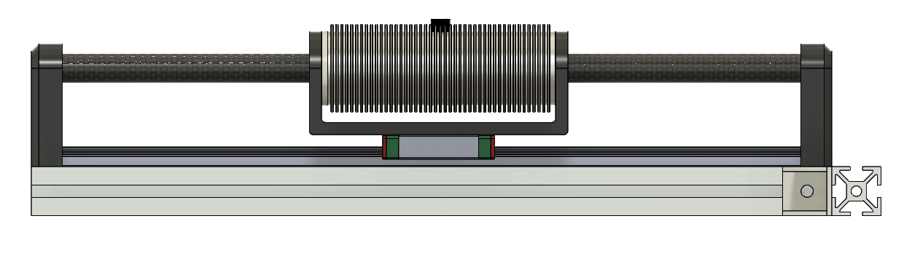
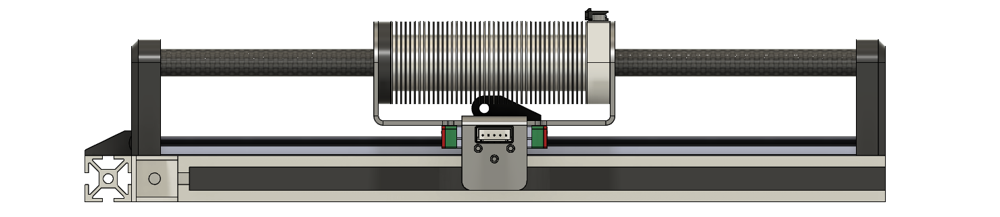

### Prototype Beta

Prototype Beta explores thermal management strategies for the `ironless tubular linear` motor topology. Two conceptual design revisions were developed to inform decisions for Revision 3, which is currently being designed.

---

#### Revisions

> [!WARNING]
>
> Revisions 1 and 2 are conceptual designs not intended to be fabricated. Revision 3 takes learnings from both and is currently being designed.

#### [Revision 1](/02_motors/01_prototype_beta/rev_1/readme.md) — Thermal interface study (transformer oil, PTFE armature)

 

This is Revision 1, which was designed to begin developing thermal management strategies for `ironless tubular linear` motors. It investigates transformer oil, a `PTFE` armature, and an outer aluminum heat sink as possible thermal strategies. The revision concluded that the aluminum heat sink might work well, but transformer oil is not optimal as a thermal interface material for this application, and `PTFE` most likely won't perform as initially expected.

---

#### [Revision 2](/02_motors/01_prototype_beta/rev_2/readme.md) — Radial heat-sink design study (aluminum 6061, eddy current analysis)

 

This is Revision 2, which was designed to develop a thermal management strategy based on the conclusions from Revision 1. Revision 1 removed transformer oil as an interface material but concluded that aluminum may be a good thermal heat sink. Hence, Revision 2 performed eddy current analysis and concluded that aluminum is expected to work well. However, the thermal interface is still to be determined.

---

#### [Revision 3](/02_motors/01_prototype_beta/rev_3/readme.md) — Implementation of Prototype Beta and validation of the thermal studies

> [!important]
> Proposed Design:
>
> This prototype will most likely use an outer radial heat sink made of `aluminum`, with coils potted into that
> heat sink and the final inner bore hole being machined out.

*(TBD) — Work in progress*

This is Revision 3, which is intended to be built and validated using the boards designed alongside it. This prototype is intended to serve as validation for the thermal analysis studies conducted in Revisions 1 and 2.

---