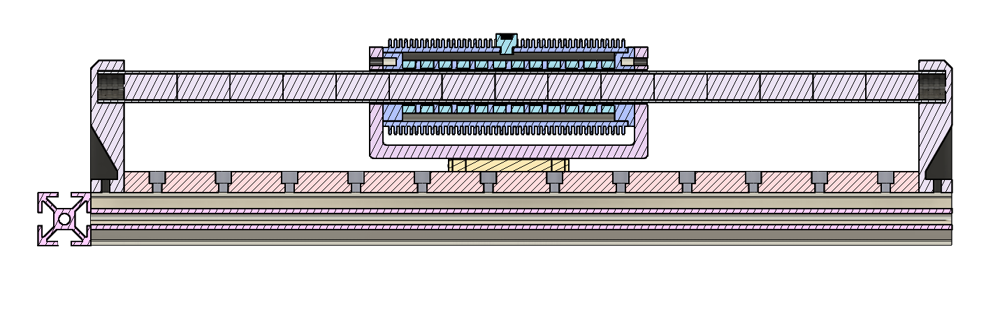
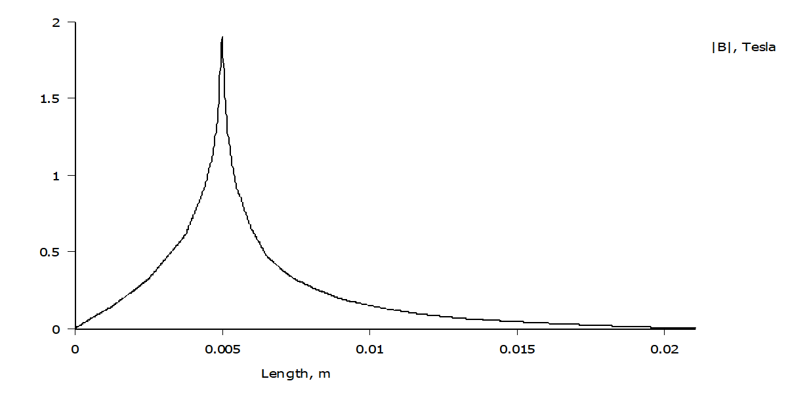

### Overview

> It has not been manufactured, experimentally validated, or verified for performance.
> Do not assume the design is suitable for fabrication without further analysis.
>
> Revisions 1 and 2 share the same electromagnetic configuration, only the thermal management and mechanical systems have been modified.

---

### Thermal interface

A specific area that `revision 1` focused on was the thermal circuit of the motor, specifically how heat is dissipated radially from the coils. To achieve this, an outer heat-sink was proposed under the assumption that eddy currents wouldn't be a problem if it was far enough away from the stator magnets. However, to achieve this, there must be an interface material between the slots and the heat-sink. This material must have good thermal characteristics, it must move heat efficiently across the boundary, and also be easy to use within the tooling constraints of the project.

     
    <em>Revision 3 — Radial distance vs. magnitude of B-field.</em>

 

Hence, an oil bath was chosen between the slots and the heat-sink. The oil would be transformer oil, sealed within the region using a threaded mechanism between the aluminum heat-sink and the armature. It was proposed that the armature should be made of `PTFE` to block the thermal pathway from the armature to the stator, decreasing temporary demagnetization of the poles within the stator. However, given the choice of `PTFE`, the armature would have to be made using subtractive methods, so the geometry would become much simpler to support that choice.

---

### Conclusion

The choice of transformer oil as an interface material may be valid for some applications, but due to the armature moving backwards and forwards at upwards of `1-5 m/s` and the thermal transient most likely being quite high, it most likely wouldn't work well. Hence, future conceptual designs should look into a different method for the thermal interface. On top of that, `PTFE` is also not an ideal armature material as it creeps. However, it does have a very low coefficient of friction, but that property would only be useful if the armature is meant to rub against the stator. Lastly, the concept of using a material with low thermal conductivity for the stator to prevent temporary demagnetization is interesting, but it was not proven possible or not with this conceptual design, except that `PTFE` wouldn't be the best material for this.

---