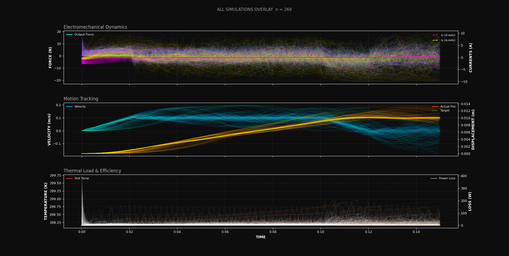

### Overview

> [!WARNING]
>
> This is a conceptual design intended to explore design ideas and engineering trade-offs.
> It has not been manufactured, experimentally validated, or verified for performance.
> Do not assume the design is suitable for fabrication without further analysis.
>
> Revisions 1 and 2 share the same electromagnetic configuration, only the thermal management and mechanical systems have been modified.

---

### Eddy Current Analysis

An interesting design note about `revision 2` is the use of a radial heat-sink made of `aluminum` specifically `6061` as conductive materials are often avoided. They are avoided because the armature produces a changing magnetic field to produce changes in energy density which lead to force. But as a consequence of this, swirling currents are induced within conductive materials near the source. These currents are called `eddy currents` or `Foucault currents` as they produce opposing magnetic fields that decrease efficiency. A proportional model is:

$$ P_e \simeq K_e \cdot B^2 \cdot f^2 \cdot t^2 \cdot V $$

Where `k_e` is a material constant, `B` is the magnetic flux density, `f` is the electrical frequency, `t` is thickness and `v` is volume. Hence the main contributing terms are:

$$ P_{loss} \propto B^2, \quad \propto f^2, \quad \propto t^2 $$

Hence, if it is assumed the electrical frequency and thickness of the fins are low and thin respectively, then using conductive materials isn't necessarily a poor electromagnetic design choice and does have thermal-conductivity benefits as most electrically conductive materials are also thermally conductive which may improve thermal steady-state performance.

Therefore, thin radial fins should be used and the secondary electrical frequency assumption should be validated. Interestingly, this assumption is relatively straightforward to validate as synchronous motors have a frequency directly related to velocity via the pole pitch:

$$ [\text{m s}^{-1}] = [\text{s}^{-1}] \cdot [\text{m}] \;\Rightarrow\; \frac{[\text{m s}^{-1}]}{[\text{m}]} = [\text{s}^{-1}] $$

Hence the electrical frequency:

$$ v = f \cdot p_{\text{pitch}} \;\rightarrow\; f = \frac{v}{p_{\text{pitch}}} $$

Therefore, with a pole pitch of `20 mm` and an assumed velocity of `1 m/s`, the electrical frequency is `50 Hz`, which can be considered low-frequency electromagnetic operation. Hence the radial heat-sink was chosen for this revision with the following parameters. The radial heat-sink is made of aluminum specifically `6061` with radial fins pitched at `1.50 mm`, axial thickness of `0.50 mm`, and radial thickness of `7.30 mm`. Grade `6061` has a higher electrical resistance compared to most aluminum grades but is still a reasonable thermal conductor at ~`180 W/(mk)`. The thermal interface material is still to be determined. This is expected to improve thermal steady-state conditions, though both this assumption and the analytical eddy-current model remain to be validated experimentally.

---

This is an extension of the work described above. The graph shows 296 motor designs transitioning from point A to point B at a target velocity of `200 mm/s`. The goal of this study was to optimize the motor design using evolutionary algorithms. The simulation ran for 7 days and solved approximately `1.5 million` finite element frames, as each point-to-point simulation was a quasi-transient loop.

The code is not included in this repository because it would be practically impossible to validate, and the PD-PI loop contained a few errors that shifted the results.

---