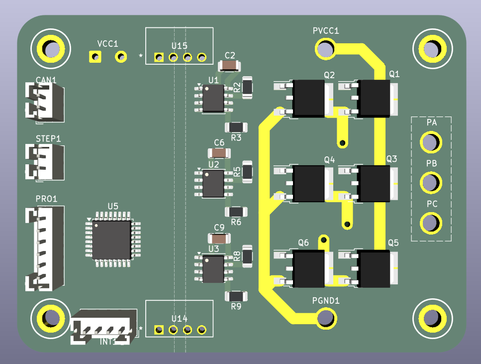
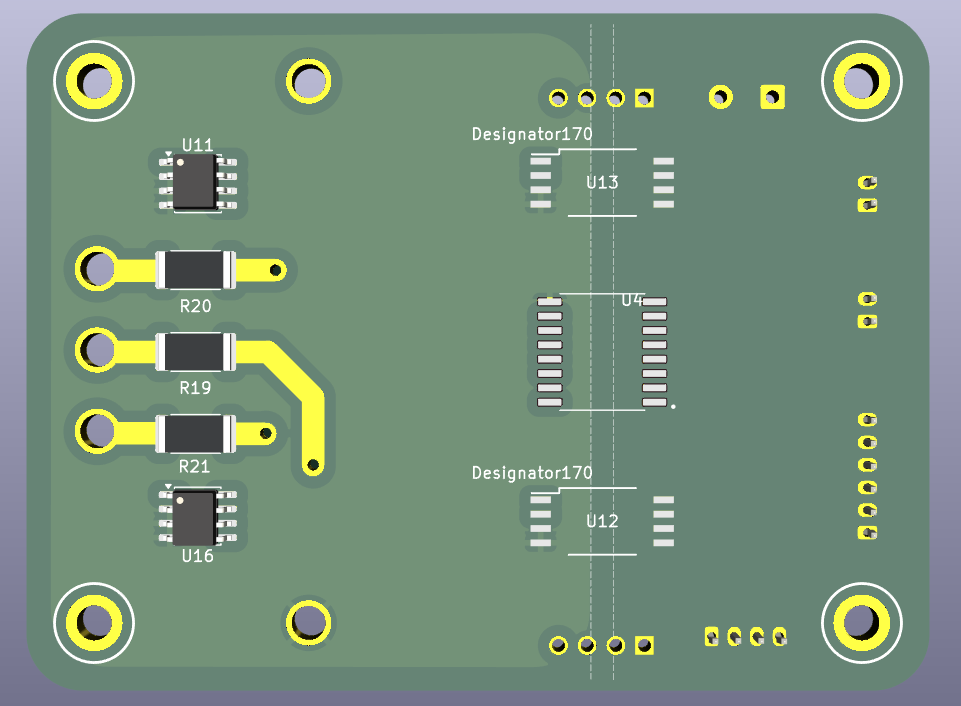

### Overview

<div align="center">
  <table>
    <tr>
      <td></td>
      <td></td>
    </tr>
    <tr>
      <td><em>Top-side</em></td>
      <td><em>Bottom-Side</em></td>
    </tr>
  </table>
</div>

OpenLSM uses `field-oriented control` to position the motor's armature. 
This requires precise position and current measurement, as well as the ability to generate a controllable 3-phase output to drive the motor.

Hence, this board is designed to take the position of the armature and the current flowing through each phase, then control the position and acceleration using variable 3-phase control.

---

### High-level Topology

*(TBD) — Work in progress*

---

### Driver & Switches Topology

*(To Be Expanded) — Work in progress*

Uses the `IRS2104` gate driver for each half-bridge and the `SUD90330E` N-channel MOSFET for the switches.

---

### Power Topology

*(To Be Expanded) — Work in progress*


```
Control Side:
INPUT (24v) -> LM2596S-12 (12v) LM2596S-5 (5v) -> LD1117V33 (3.3v) 

------------------------------------------------------------------

Isolated Side:
Input (up to 96V), Isolated 12V (CME0303S5C) & Isolated 3.3V (CME0512S3C)
```

---

### Current Sensing Topology

*(TBD) — Work in progress*

---

### Mechanical Considerations

*(To Be Expanded) — Work in progress*

JST connectors are used on the control side, whereas the power inputs are soldering points on the board, with the motor side having strain reliefs. 
The board is `80 mm` in length and `60 mm` in width with a `5 mm` edge radius. 
The board has 4 layers with an isolation line separating the two domains. 
The board also has M3 bolt holes with a diameter of `~3.10 mm` in a rectangular mounting pattern of `68 mm` and `48 mm`.

> Each M2 bolt is isolated from the GND and PGND planes due to the isolated domains.
---

### Software Considerations

*(TBD) — Work in progress*

> Programming is done via a `2×3 pin`, `2.54 mm` vertical male connector on the board, located near the `STM32G431K8Tx`.

---

### Documentation

Design notes and implementation decisions are documented in [issue #12](https://github.com/wgbowley/OpenLSM/issues/12).

> BOM can be found here: [BOM.md](BOM.md)

---