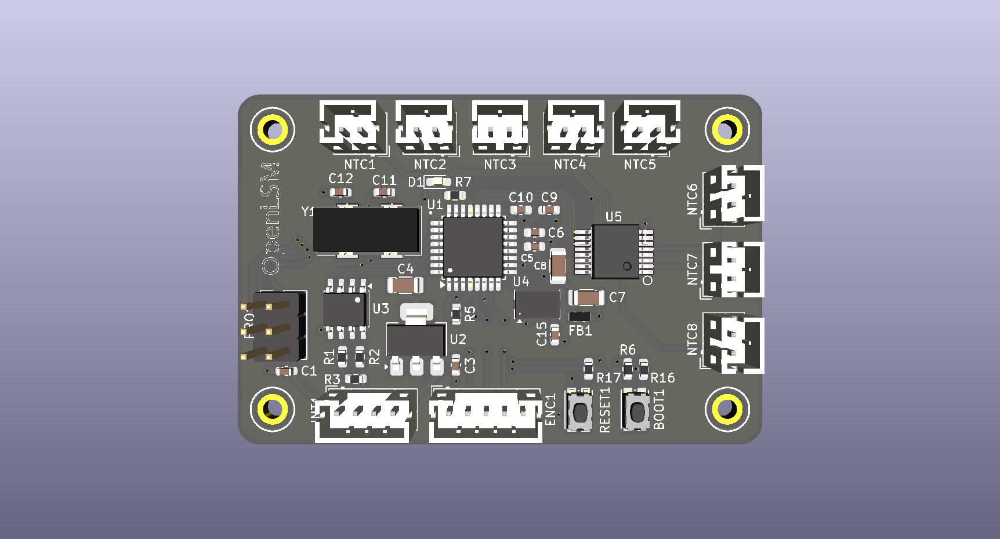
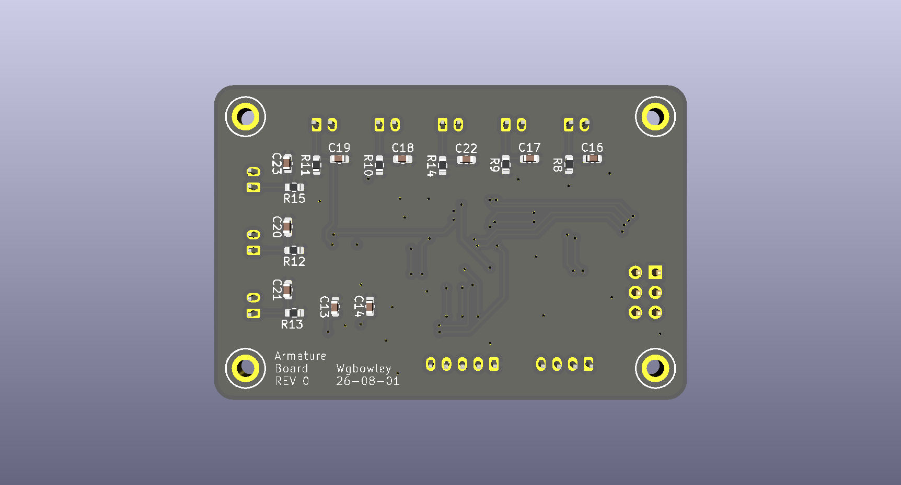
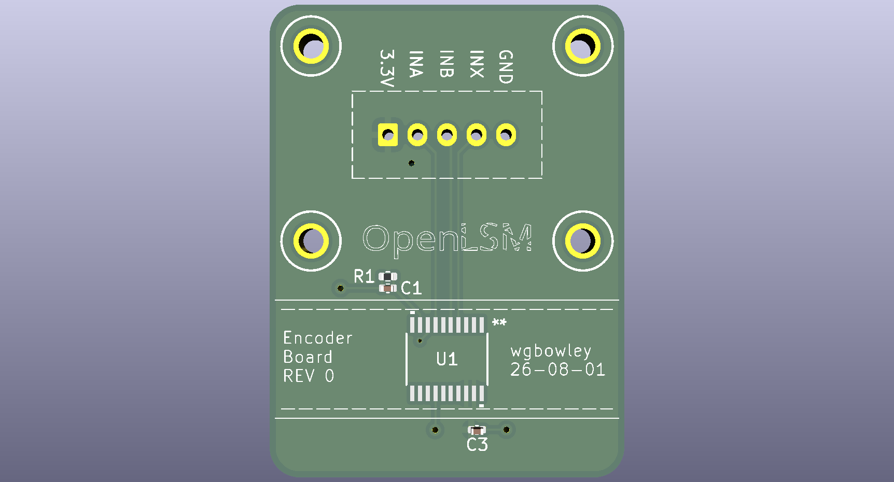
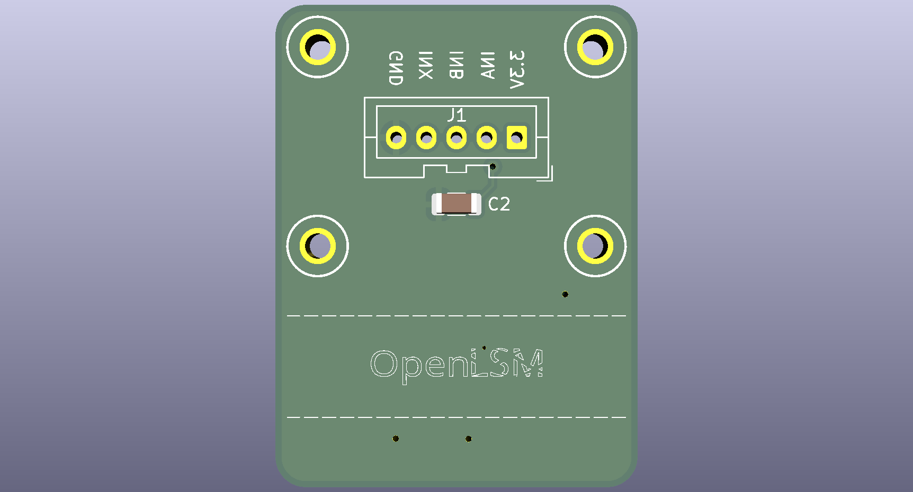

### Boards

*(TBD) — Work in progress*

---

#### [00_bridge_driver](00_bridge_driver/readme.md) — Triple Half-Bridge Driver (WIP)

A triple half-bridge driver with an operating voltage of `0–96 V` and current of `0–25 A`. It supports `step/dir` and `CANBUS` input interfaces, incremental encoder and Hall-effect sensor inputs from the motor, and `RS-485/RS-422` for the armature board. The board has two main domains: the `12 V` input and the `0–96 V` driver input. It features isolation between the MCU, the bridge driver, and the current sensor chips.

---

#### [01_armature_board](01_armature_board/readme.md) — Sensor Board (Manufacturing)

  <table>
    <tr>
      <td></td>
      <td></td>
    </tr>
    <tr>
      <td><em>Top layer — STM32, thermistor array, accelerometer & encoder</em></td>
      <td><em>Bottom layer — base resistors & decoupling capacitors for thermistors</em></td>
    </tr>
  </table>

A sensor board that connects to the driver over `RS-485/RS-422`. It features `8` NTC thermistors switched via an analog multiplexer to produce a thermal profile `T(z, t)`. The board also includes a `3-axis SPI accelerometer` and processes data from the encoder board.

---

#### [02_magnetic_encoder](02_magnetic_encoder/readme.md) — Linear Encoder Breakout (Manufacturing)

  <table>
    <tr>
      <td></td>
      <td></td>
    </tr>
    <tr>
      <td><em>Top layer — facing the magnetic scale</em></td>
      <td><em>Bottom layer — JST XH 5-pin & mounting side</em></td>
    </tr>
  </table>

A breakout and mechanical interface for the `AS5311` linear encoder, providing a resolution of `1.95 µm` and an estimated accuracy of `10–20 µm`, depending on mechanical implementation factors. The encoder operates from `0–600 mm/s` and is an incremental `A`, `B`, `Index` type.
