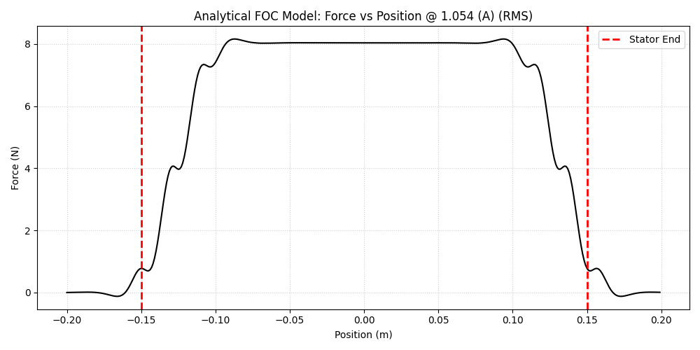
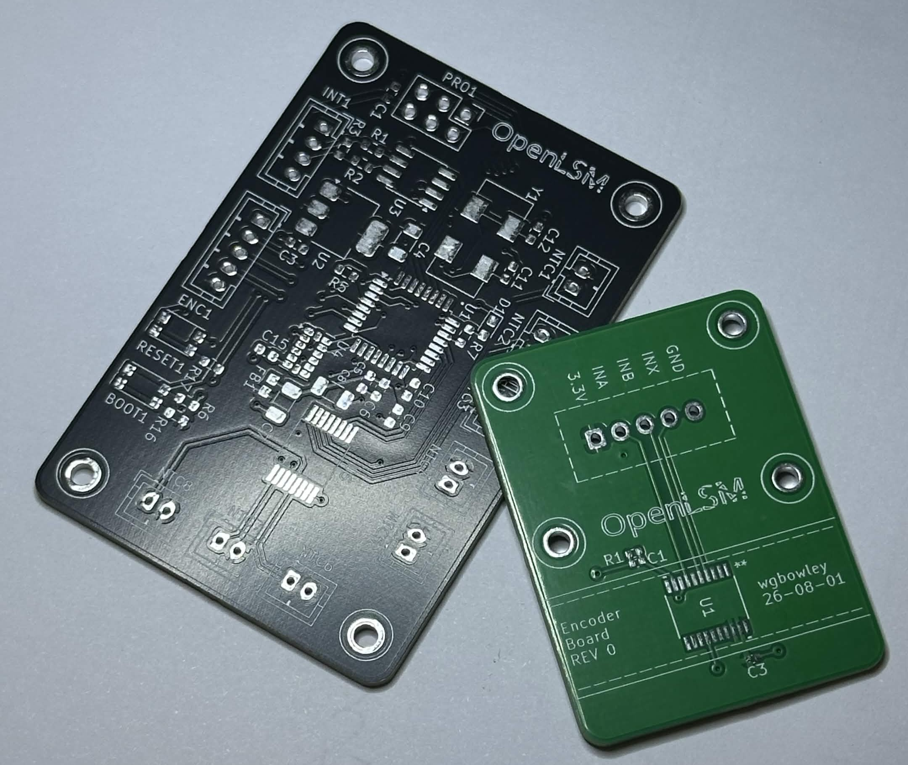
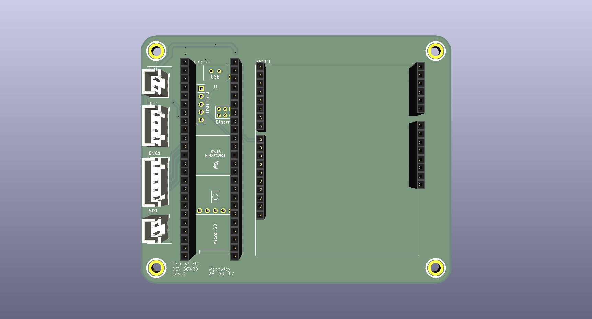
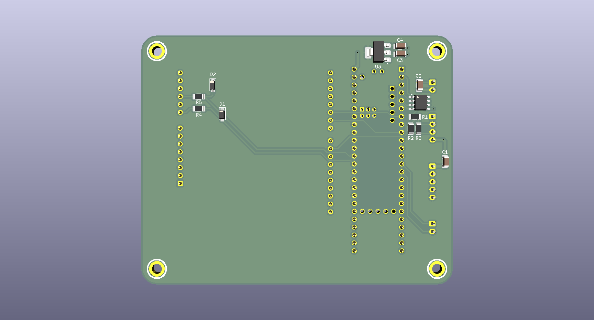

<!--
Color Palette:
FFFFFF - pure white 
FF8F0E - bold, warm orange with a strong golden-yellow undertone

I'm going to do a little experiment here and not update the logo
until someone raises an issue about light-mode readability.
- William Bowley, 2026-07-05

P.S: Thanks for downloading the OpenLSM repository `▽`ʃ♡
-->


<div align="center">
  
  
  Low-Cost Linear Synchronous Permanent-Magnet Motor Platform <br>
  Engineered by [`William Bowley`](https://github.com/wgbowley), 
  with contributions from [`Lawson Gallup`](https://github.com/LawsonDG)
</div>

### Overview

OpenLSM is an experimental project with the objective of designing low-cost permanent magnet linear motors for Cartesian motion systems such as pick-and-place machines or CNC machines. 
The project will fulfill this goal by using readily available materials and tooling, combined with analytical and hybrid models.

> This project has no commercial aspirations. Its contents will remain available under the `MIT` License.

### Objectives

```
- [x] Support voltage bus ranges of `12 V_dc`, `24 V_dc`, and `48 V_dc`.
- [/] Achieve a target force per amp of `3.0 N/A_rms`.
- [/] Reach an asymptote temperature of `60°C` under standard use-cases.
- [/] Validate the driver board and linear encoder board for linear motor applications.
- [ ] Validate motor performance and generate performance curves for each voltage range.
- [ ] Scope a `Prototype Gamma` as an entry point for contributors to extend beyond OpenLSM.
```

> *(Note). `[ ]` Not started. `[/]` In progress. `[x]` Complete.*

---

### Alpha ($\alpha$)

An `ironless planar linear` motor with a polylactic acid (PLA) armature featuring `6` slots, hand wound using `0.2 mm` diameter enameled copper wire and `5 mm` wide Kapton tape, with `2` slots in-series per phase `(WYE)`. The stator, similar to the armature, was printed in PLA and had `4` pole pairs per armature length and `10` pole pairs total. The motor produced measurable force, although the force output was not quantified before the PLA coil forms deformed due to thermal stress.

<div align="center">
  
  <br>
  <em>Alpha: Side view on test stand</em>
</div>

<br>

The main conclusion from Prototype Alpha is that `planar linear motors` likely require `laminated silicon steel` armatures to produce force efficiently. In response, Prototype Beta shifts to an `ironless tubular topology` with the goal of quantifying force output and thermal performance.

See the [`alpha notes`](/02_motors/00_prototype_alpha/readme.md) for the full report on Prototype Alpha.

---

### Beta ($\beta$)

> *(Conceptual). Revision 2 of the ironless tubular linear motor design. Not for fabrication.*  <br>
> *(Paused). Revision 3 will be designed and fabricated. Paused until PCB design finishes.*

An `ironless tubular linear` motor with a carbon fibre nylon (PA6-CF) armature featuring `12` slots, mechanically wound using `0.4 mm` diameter enameled copper wire, with `4` slots in-series per phase `(WYE)`. The stator, unlike the armature, is made of layered carbon fibre epoxy to form a tube with an internal radius of `5 mm` and outer radius of `6 mm`. The poles are `20 mm` in length and `5 mm` in radius such that they can be inserted into the stator tube in this pole arrangement `(N-S|S-N)`, using generic superglue to secure the end poles.

<div align="center">
  
    <p><em>Beta: Cross-sectional view of the tubular linear motor showing the stator and armature.</em></p>
</div>

> See the [`motor design notes`](/02_motors/01_prototype_beta/rev_2/readme.md) for the full electromagnetic and thermal rationale of `Revision 2`.

The radial heat-sink is made of aluminum with radial fins pitched at `1.50 mm`, axial thickness of `0.50 mm`, and radial thickness of `7.30 mm`. The thermal interface material is still to be determined. This is expected to improve thermal steady-state conditions, though both this assumption and the analytical eddy-current model remain to be validated experimentally.

---

### Simulations

#### Analytical

This analytical model uses inverse Clarke and Park transforms to compute the phase current based on position, then uses 1D field approximations to compute the magnetic co-energy, and finally uses its spatial derivative over the z-axis to compute force.


<div align="center">
  
  <p><em>1D field approximation and FOC showing position (linear) vs force (linear).</em></p>
</div>


See the [`Model Notes`](./01_simulation/00_analytical/readme.md) for the mathematical/computational implementation.

### Hybrid

> *(Work in progress). This hybrid simulation is currently being designed and implemented.*

A hybrid model using `FEMM` to compute the stator field, then using the Biot–Savart law with a parametric slot geometry to compute the armature field. 
The magnetic co-energy is then calculated assuming uniform magnetic permeability, and finally the spatial derivative over the z-axis is used to compute force.

See the [`Model Notes`](./01_simulation/01_hybrid/readme.md) for the mathematical/computational implementation.

---

### Bridge Driver

> *(Work in progress). This board is currently being designed and implemented.*

An isolated triple half-bridge driver with an MCU-side domain of `24 V (DC)` and a power domain of `12-96 V (RMS)`, 
with current up to `20 A (RMS)`. It supports `step/dir` and `CANBUS` input interfaces and uses `RS-485/RS-422` for 
communication with external input boards for encoders, Hall-effect sensors, etc. 

See [`00_bridge_driver`](/03_boards/00_bridge_driver/) for the detailed design, schematic, PCB, and BOM.

---

### Integrated Sensor Boards

> *(Ordered). The armature board revision 1 has been ordered from JCLPCB* <br>
> *(Validation). The encoder board revision 0 has been populated and requires validation.*

The integrated sensor boards are a platform for measuring the motor's position, acceleration, and thermal profile `T(z, t)`. 
The system consists of two boards: an encoder board with an estimated accuracy of `10–20 µm`, and a sensor board featuring a thermistor array, `3-axis` SPI accelerometer, encoder interface, and `RS-485/RS-422` output, all controlled via an `STM32`.

<div align="center">
  
  <p><em>Bare Rev 0 armature board (black) & Bare encoder board (green)</em></p>
</div>

See [`03_boards`](/03_boards/readme.md) for the supporting PCB designs that enable motor development.

---

### TeensySFOC
> *(Ordered). The TeensySFOC board revision 0 has been ordered from JCLPCB*

The Teensy SFOC board is a breakout board for the Teensy 4.1 and SimpleFOC Arduino shield with `step/dir` input. 
It is a development board that is not intend for long-term usage.

<div align="center">
  <table>
    <tr>
      <td></td>
      <td></td>
    </tr>
    <tr>
      <td><em>Top layer — Teensy & SimpleFOC shield</em></td>
      <td><em>Bottom layer — Supporting electronics</em></td>
    </tr>
  </table>
</div>

---

### Documentation

Each section of the repo is self-documenting.  
For internal documentation, credits, and contributors, refer to [`00_docs`](./00_docs/).

#### Bibtex

```
@misc{openLSM_2026,
  author = {William Bowley and Lawson Gallup},
  title = {{openLSM: Low-Cost Linear Synchronous Permanent-Magnet Motor Platform}},
  url = {https://github.com/wgbowley/openLSM},
  year = {2026},
  note = {GitHub repository},
  license = {MIT}
}
```

---
