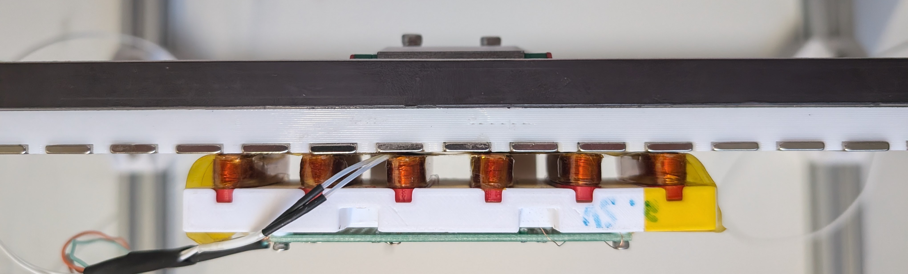
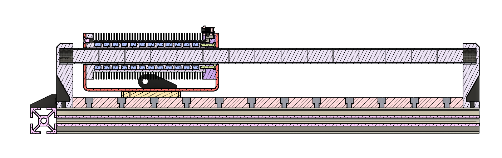
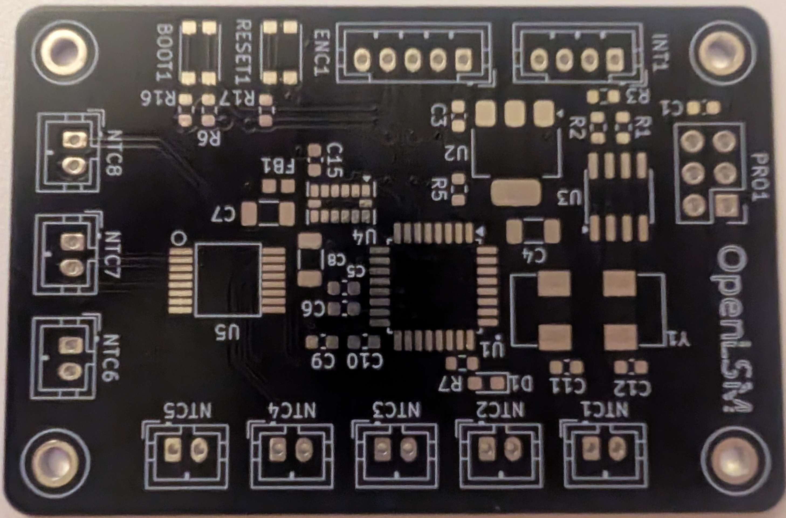
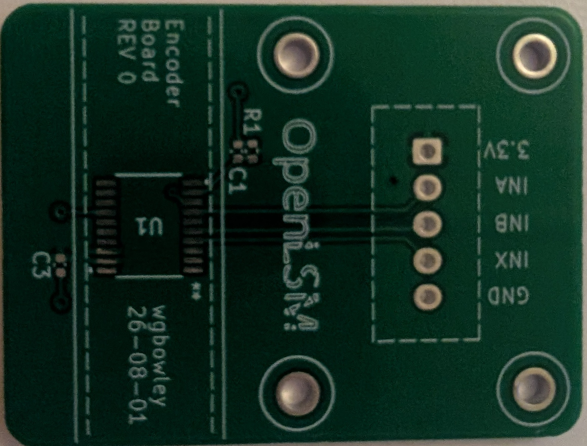

<!--
Color Palette:
FFFFFF - pure white 
FF8F0E - bold, warm orange with a strong golden-yellow undertone

I'm going to do a little experiment here and not update the logo
until someone raises an issue about light-mode readability.
- William Bowley, 2026-07-05

P.S: Thanks for downloading the OpenLSM repository `▽`ʃ♡
-->

<p align="center">
  
  <br>
  <em>
    Low-Cost Linear Synchronous Permanent-Magnet Motor Platform
    <br>
    Engineered by 
    <a href="https://github.com/wgbowley">William Bowley</a>, 
    with contributions from 
    <a href="https://github.com/LawsonDG">Lawson Gallup</a>
  </em>
</p>

### Overview


OpenLSM is an experimental project with the objective of designing low-cost permanent magnet linear motors for Cartesian motion systems such as pick-and-place machines or CNC machines. The project will fulfill this goal by using readily available materials and tooling, combined with analytical and hybrid models.

### Objectives

```
- Support voltage ranges of `12 V`, `24 V`, and `48 V`.
- Achieve a target force per amp of `3.0 N/A` (rms).
- Reach an asymptote temperature of `60°C` under standard use-cases.
- Validate the driver board and linear encoder board for linear motor applications.
- Validate motor performance and generate performance curves for each voltage range.
- Scope a `Prototype Gamma` as an entry point for contributors to extend beyond OpenLSM.
```

> This project has no commercial aspirations. Its designs and contributions will remain available under the `MIT` License.

---

### Alpha ($\alpha$)

An `ironless planar linear` motor with a polylactic acid (PLA) armature featuring `6` slots, hand wound using `0.2 mm` diameter enameled copper wire and `5 mm` wide Kapton tape, with `2` slots in-series per phase `(WYE)`. The stator, similar to the armature, was printed in PLA and had `4` pole pairs per armature length and `10` pole pairs total. The motor produced measurable force, although the force output was not quantified before the PLA coil forms deformed due to thermal stress.

<div align="center">
  
  <br>
  <em>Alpha: Side view on test stand</em>
</div>

<br>

The main conclusion from Prototype Alpha is that `planar linear motors` likely require `laminated silicon steel` armatures to produce force efficiently. In response, Prototype Beta shifts to an `ironless tubular topology` with the goal of quantifying force output and thermal performance.

See the [alpha notes](/02_motors/00_prototype_alpha/readme.md) for the full report on Prototype Alpha.

---

### Beta ($\beta$)

> *(Conceptual). Revision 2 of the ironless tubular linear motor design. Not for fabrication.*  
> *(Note). Revision 3 of the ironless tubular linear motor will be fabricated.*

An `ironless tubular linear` motor with a carbon fibre nylon (PA6-CF) armature featuring `12` slots, mechanically wound using `0.4 mm` diameter enameled copper wire, with `4` slots in-series per phase `(WYE)`. The stator, unlike the armature, is made of layered carbon fibre epoxy to form a tube with an internal radius of `5 mm` and outer radius of `6 mm`. The poles are `20 mm` in length and `5 mm` in radius such that they can be inserted into the stator tube in this pole arrangement `(N-S|S-N)`, using generic superglue to secure the end poles.

<div align="center">
  
    <p><em>Beta: Cross-sectional view of the tubular linear motor showing the stator and armature.</em></p>
</div>

> See the [motor design notes](/02_motors/01_prototype_beta/rev_2/readme.md) for the full electromagnetic and thermal rationale of `Revision 2`.

The radial heat-sink is made of aluminum with radial fins pitched at `1.50 mm`, axial thickness of `0.50 mm`, and radial thickness of `7.30 mm`. The thermal interface material is still to be determined. This is expected to improve thermal steady-state conditions, though both this assumption and the analytical eddy-current model remain to be validated experimentally.

---

### Analytical & Hybrid Simulations

*(TBD) — Work in progress*

#### Analytical

This analytical model uses 1D field approximations and inverse Clarke and Park transforms to move the motor armature along the stator to produce a force vs position curve.

#### Hybrid

This hybrid model is proposed to use finite element methods to produce a vector potential field for the magnets, and then use the Biot–Savart law analytically for the coils. This proposed workflow may produce more accurate dynamics than the 1D analytical model.

---

### Bridge Driver

*(TBD) — Work in progress*

A triple half-bridge driver with an operating voltage of `0–96 V` and current of `0–25 A`. It supports `step/dir` and `CANBUS` input interfaces, incremental encoder and Hall-effect sensor inputs from the motor, and `RS-485/RS-422` for the armature board.

---

### Integrated Sensor Boards

> *(Fabrication). These boards have been made, but they haven't been populated or validated yet.*

The integrated sensor boards are a platform for measuring the motor's position, acceleration, and thermal profile `T(z, t)`. The system consists of two boards: an encoder board with an estimated accuracy of `10–20 µm`, and a sensor board featuring a thermistor array, `3-axis` SPI accelerometer, encoder interface, and `RS-485/RS-422` output, all controlled via an `STM32`.

<!-- Need to update those images with the populated PCBs and also they need to be cleaned up -->
<!-- They need to be updated in general. Those images are pretty poor quality --> 

<div align="center">
  <table>
    <tr>
      <td></td>
      <td></td>
    </tr>
    <tr>
      <td><em>Armature Data Board</em></td>
      <td><em>Encoder Board</em></td>
    </tr>
  </table>
</div>

See [03_boards](/03_boards/readme.md) for the supporting PCB designs that enable motor development.

---

### Documentation

Each section of the repo is self-documenting.  
For internal documentation, credits, and contributors, refer to [04_docs](./04_docs/).

---