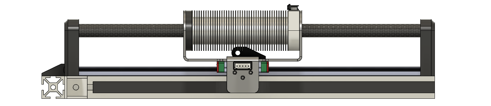
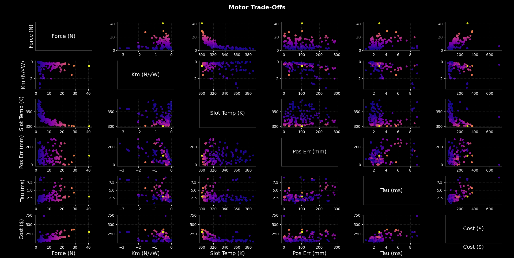
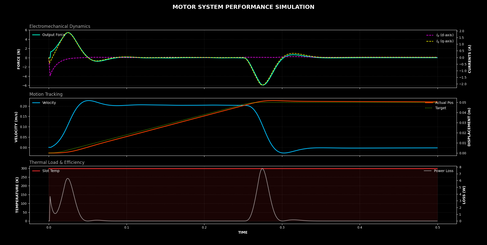

<p align="center">
  
  <br>
  <em> High Performance Low Cost Linear Motors – Designed & built by <a href="https://github.com/wgbowley">William Bowley</a> & <a href="https://github.com/LawsonDG">Lawson Gallup</a> </em>
</p>

---
FDM 3D printers have evolved from commercial to household items, but they still rely on belts and pulleys, which wear out after a few thousand hours of use. Their motion system was perfect for nearly three decades, but micro-stepping can only take us so far. While AC servo motors address the micro-stepping problem, they depend on the same motion system. Furthermore, they cost upwards of 10 to 20 times more while also requiring dedicated driver boards.


## Overview


OpenLSM is a research project striving to produce high-performance linear motors while minimising complexity. The hybrid acronym “OpenLSM” stands for open linear synchronous motors, essentially the same technology used in modern drones and electric vehicles. Linear motors use the same fundamental principles; however, they are built with different geometries to achieve their linear motion.


They should allow for continuous motion at the hardware level, while also having no expandability issues. Whereas for core-xy, it requires approximately 4mm of belt length for every 1 mm of extra travel distance. That leads to harmonic problems, which are resolved with belt tensioning. That ultimately stresses the frame while also wearing down the pulleys' teeth. However, it should be emphasized that these longevity issues are mostly a problem for large-format FDM printers. Linear motors avoid these problems due to their reliance on direct motion and minimal mechanical parts. 

## Prototype 0: The curse of blindly following standards

The first prototype demonstrated poor force output with approximately ```0.5N``` at ```20W``` input power. Which is ```30``` times off the force target. However, it is not all doom and gloom; the general architecture of the “flat” linear motor did work, just very poorly. Even with speculative improvements, it would require ~```400W``` to reach the minimal target force for a single axis. 

<div align="center">
  
</div>


The main insights from this prototype are that the flat linear motor is commercially the standard, but must heavily rely on the usage of laminated silicon steel armatures. They are quite complex to manufacture, hence breaking the project objectives. A new architecture must be explored in the future. Another key insight is that thermal analysis must be considered with magneto analysis. Or risk the coil forms melting during testing again. Hence, a multi-physics approach is required for future design to succeed. Lastly, the high phase resistance led to the motor operating under voltage-limiting conditions, and thus, minimal current could be delivered. 

  > [!NOTE]
  > This path may still be revisited; limited documentation can be found in [prototype_0](/motors/prototype_0/)


## Prototype 1: Experimentation rather than standards

This prototype is based on work done by cmore839 on his tubular linear motor ([DIY Linear Motor](https://github.com/cmore839/DIY-Linear-Motor)). This motor type is ideal for ironless designs as it geometrically guides flux rather than using highly permeable materials. Also simplifies construction due to everything being radially/axially referenced.

[](https://a360.co/4bnGirH)

The preliminary design phase begins with setting up a simulation stack aimed at acting as a "digital twin" of the motor. The specific architecture consisted of an kinematic trajectory feeder into a PD position controller into a PI current controller, which drove the FEA (finite element analysis) model. The FEA model itself was a quasi-transient electro-magneto-thermal-mechanical model, which allowed the thermal problems encountered in prototype 0 to be properly addressed. Once the simulation stack was numerically stable, an NSGA-3 optimization run was performed, requiring roughly ```1.05``` million FEA solutions across ```1,012``` motors. It should be noted, however, that due to controller instability and optimizer exploits, the position and K_m results are incorrect; the Pareto front ended up serving more as a spatial navigator than a direct optimization pipeline.

The Pareto front was nonetheless integral to finding better solutions through manual pattern extraction and simulation. The design eventually arrived at had a force per amp of ```1.626 N/A```, phase resistance of ```1.831 Ω```, and phase inductance of ```15.92 mH```. This results in the motor having a peak force of ```~16N``` which is ```32``` times better than prototype 0 while costing ~```$60``` for 300mm. One problem remained, however: thermals. At only ```2.7 A```, approximately ```40 W``` is lost in the armature, resulting in asymptotic temperatures of ```130 °C``` at the poles and ```171 °C``` in the slots, which is what caused the motor to burn out under asymptotic assumptions.



Looking at the physics, the only solution was to increase the surface area using a thermally conductive material. The catch is that most thermally conductive materials are also electrically conductive, which is a well-known problem in motor design; eddy currents form, leading to joule heating and magnetic braking. Interestingly, though, examining the approximate eddy current formula, two terms stood out: frequency (f) and flux density (B):

$$ P_e = K_e \cdot B^2 \cdot f^2 \cdot t^2 \cdot V $$

The tubular linear motor's geometry is notable here. As mentioned above, flux is focused within the core, meaning flux density at the radial edge of the coils is only ```0.25 T```. Even more notably, the synchronous frequency at ```1 m/s``` is just ```25 Hz```. This leads to the conclusion that eddy currents and skin effects are a non-issue for this motor, owing to its geometry and low operating frequency. A 6061 aluminum heat sink was therefore partially designed via Bayesian optimization and then refined for ease of manufacturing, bringing asymptotic temperatures down to 47.85 °C and 58.85 °C at the poles and slots, respectively. The improvement is significant, though it bears mentioning that these figures assume a convection coefficient of ```20 W/(m²K)```, which may be optimistic. Even at ```10 W/(m²K)```, temperatures reach ```76.85 °C``` and ```88.85 °C```, approaching thermal throttling territory, but this scenario assumes the motor is sustaining ~5 N continuously, which is highly atypical for a 3D printer. A more representative force/power curve for a standard 50 mm point-to-point path is shown below. 



That covers the bulk of the electromechanical design work carried out between January and March. The next steps are finishing the armature data-boards and the ```10-20A``` A triple H-bridge driver, as well as building a coil winder capable of achieving a fill factor of ```0.65``` with inductance and resistance matching. After that, the motor can be built, validated, and released to the community. Thanks for reading — hopefully this was an interesting one. The next update should land around April–May with prototype 1 physically validated.


# Credits:

### Research & Development Enabled by:
* [FEMM](https://www.femm.info/wiki/HomePage) - Thank you, Dr. Meeker, for creating FEMM; it was indispensable for prototype 1.
* [SimpleFOC](https://simplefoc.com/) - Thank you, everyone, at simple-foc for developing such a wonderful driver, specifically Runger, for the encoder help.
* Thank you, [Matthew Sorensen](https://sorens.in), for your research into the usage of the AS5311 for 3d printers
* Thank you, [cmore839](https://github.com/cmore839), for your research into tubular linear motors and for creating your very informative Discord server.
* Thank you, [Screbuts @ World of Engineer](https://discord.gg/YFEveHYyeB), for the initial scoping help.


### Bibtex Citation:

```
@misc{Bowley_Gallup_2026,
  author = {Bowley, William and Gallup, Lawson},
  title = {{openLSM}},
  url = {https://github.com/wgbowley/openLSM},
  year = {2026},
  note = {GitHub repository},
  license = {MIT}
}
```
