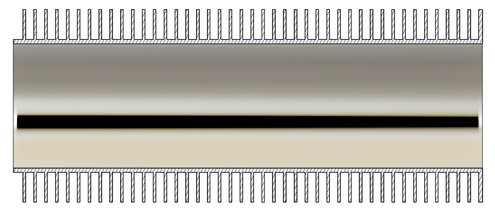

<!--
Color Palette:
FFFFFF - pure white 
FF8F0E - bold, warm orange with a strong golden-yellow undertone

I'm going to do a little experiment here and not update the logo
until someone raises an issue about light-mode readability.
- William Bowley, 2026-07-05

P.S: Thanks for downloading the OpenLSM repository `▽`ʃ♡
-->

<p align="center">
  
  <br>
  <em>
    Low Cost Linear Synchronous Motors – Designed & built by 
    <a href="https://github.com/wgbowley">William Bowley</a> (primary) &amp; 
    <a href="https://github.com/LawsonDG">Lawson Gallup</a>
  </em>
</p>

## Overview


OpenLSM is an experimental project with the objective of designing low-cost permanent magnet linear motors for Cartesian motion systems such as pick-and-place machines or CNC machines. The project will fulfill this goal by using readily available materials and tooling, combined with reduced-order and finite element models.

### Objectives

> [!IMPORTANT]
> - Design low-cost permanent magnet linear motors for Cartesian motion systems.
> - Develop computational models that are validated against experimental measurements.
> - Demonstrate continuous thermal steady-state operation under defined operating conditions.
>
> *More specific targets (force density, efficiency, cost, etc.) to be defined as the domain becomes clearer.*

## Methodology

The methodology for openLSM is to design a reduced-order or finite element model to compute the expected results for a specific motor topology. The resulting model is used to tune design parameters either manually or via algorithmic optimization. The parameters are then used to produce a CAD model, which is fabricated and experimentally tested. Discrepancies between predicted and observed performance are used to update the model for subsequent iterations.

```
Conceptual Design ↔ Reduced-order / FEA Model
      ↓
Design Parameters ↔ Detailed Design (CAD)
      ↓
Fabrication & Testing
      ↓
Post-Analysis & Model Validation
      ↺
```
<div align="center">
  <em>
  Figure 1: OpenLSM design methodology. Computational models are iteratively refined through experimental validation.</em>
</div>

## Prototype Alpha


<div align="center">
  
  <em>Figure 2a: Prototype Alpha. Side view on test stand</em>
</div>


An `ironless planar linear` motor with a polylactic acid (PLA) armature featuring `6` slots, hand wound using `0.2 mm` diameter enameled copper wire and `5 mm` wide Kapton tape, with `2` slots in-series per phase `(WYE)`. The stator, similar to the armature, was printed in PLA and had `4` pole pairs per armature length and `10` pole pairs total. The motor produced measurable force, though the magnitude was not quantified before the PLA coil forms deformed due to thermal stress.

<div align="center">
  
    <p><em>Figure 2b: Prototype Alpha. Top-down view of the planar linear motor showing the slots & poles.</em></p>
</div>

The main conclusion from Prototype Alpha is that `planar linear motors` likely require `laminated silicon steel` armatures to produce force efficiently. In response, Prototype Beta shifts to an `ironless tubular topology` with the goal of quantifying force output and thermal performance.

## Prototype Beta
*(Conceptual). Revision 2 of the ironless tubular linear motor design. Not yet validated for fabrication.*

An `ironless tubular linear` motor with a carbon fibre nylon (PA6-CF) armature featuring `12` slots, mechanically wound using `0.4 mm` diameter enameled copper wire, with `4` slots in-series per phase `(WYE)`. The stator, unlike the armature, is made of layered carbon fibre epoxy to form a tube with an internal radius of `5 mm` and outer radius of `6 mm`. The poles are `20 mm` in length and `5 mm` in radius such that they can be inserted into the stator tube in this pole arrangement `(N-S|S-N)`, using generic superglue to secure the end poles.

<div align="center">
  
    <p><em>Figure 3a: Prototype Beta REV 2. Cross-sectional view of the tubular linear motor showing the stator & armature.</em></p>
</div>

Revision 2 uses a radial heat-sink design which may improve steady-state characteristics, but the grade `6061` aluminum does introduce `eddy currents` which produce opposing magnetic fields that decrease efficiency. The design hypothesis is that thermal benefits outweigh eddy-current losses at the expected operating frequency. This is evaluated in the linked analysis.

<div align="center">
  
    <p><em>Figure 3b: Prototype Beta REV 2. Close-up cross-sectional view of the radial heat-sink.</em></p>
</div>

The radial heat-sink is made of aluminum as mentioned above with radial fins pitched at `1.50 mm`, axial thickness of `0.50 mm`, and radial thickness of `7.30 mm`. The thermal interface material is still to be determined. This is expected to improve thermal steady-state conditions, though both this assumption and the analytical eddy-current model remain to be validated experimentally.

> [!IMPORTANT]
> See the [motor design notes](/02_motors/02_prototype_beta/rev_2/readme.md) for the full electromagnetic and thermal rationale of `Revision 2`.

---

> [!note]
> See [03_boards](/03_boards/readme.md) for the supporting PCB designs that enable motor development.

## Documentation
All internal documentation can be found within this repo's [issues](https://github.com/wgbowley/OpenLSM/issues). 

### Credits:
Acknowledgements and credits can be found in the [credits file](/credits.md).
