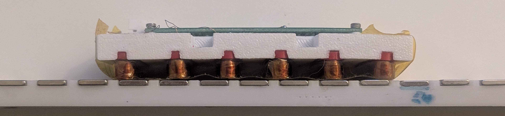

  
   
  <em> Low Cost Linear Synchronous Motors – Designed & built by <a href="https://github.com/wgbowley">William Bowley</a> </em>

## Overview

OpenLSM is an experimental project with the objective of designing low-cost permanent magnet linear motors for Cartesian motion systems such as pick-and-place machines or CNC machines. The project will fulfill this goal by using accessible available materials and tooling, combined with reduced-order and finite element models.

## Methodology

The methodology for openLSM is to design a reduced-order or finite element model to compute the expected results for a specific motor topology. The resulting model is used to tune design parameters either manually or via algorithmic optimization. The parameters are than used to produce a CAD model, which is fabricated and experimentally tested. Discrepancies between predicted and observed performance are used to update the model for subsequent iterations.

> [!NOTE]
> The computational models are topology specific approximations whose validity is assessed through experimental iteration.

## Prototype Alpha

An ironless flat linear motor with a polylactic acid (PLA) armature featuring 6 slots, hand wound using 0.2 mm diameter enameled copper wire with 2 slots in-series per phase. The stator, similar to the armature, was printed in PLA and had 4 pole pairs. The motor produced force, but the amount was not quantified before the PLA coil forms melted.

  

The main conclusion from Prototype Alpha is that flat linear motors most likely require laminated silicon steel armatures to produce force efficiently. Given the project's aims, ironless tubular motors were chosen for Prototype Beta, which aims to quantify force output and thermal performance.

> [!NOTE]  
> Prototype Alpha documentation and in-depth analysis can be found [here](docs/external/prototype_alpha/).

## Prototype Beta
<!-- Need to add a goal area for this like force target, input, asymptotic temperature, etc!-->